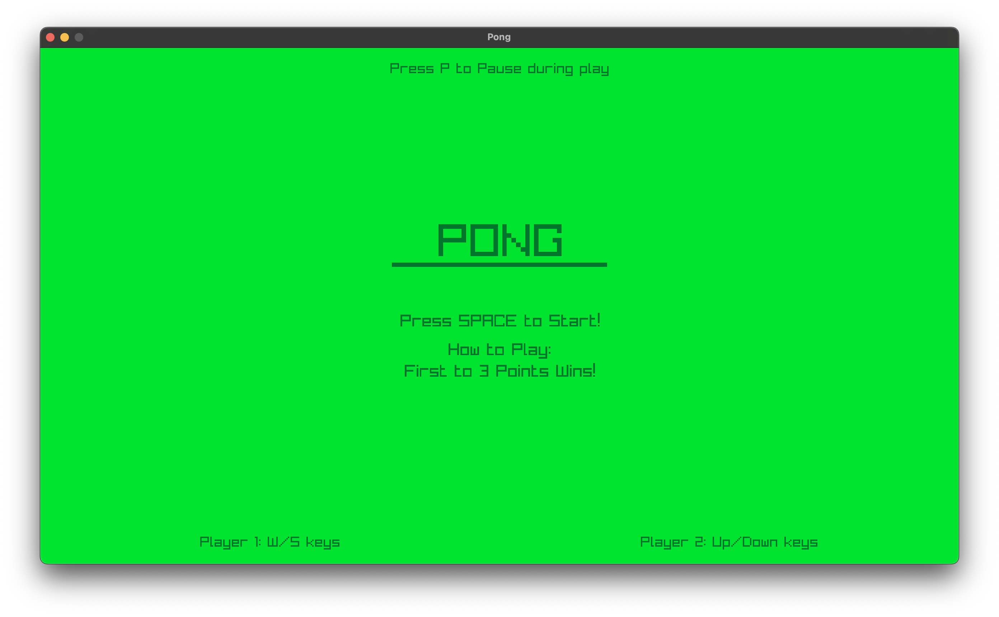
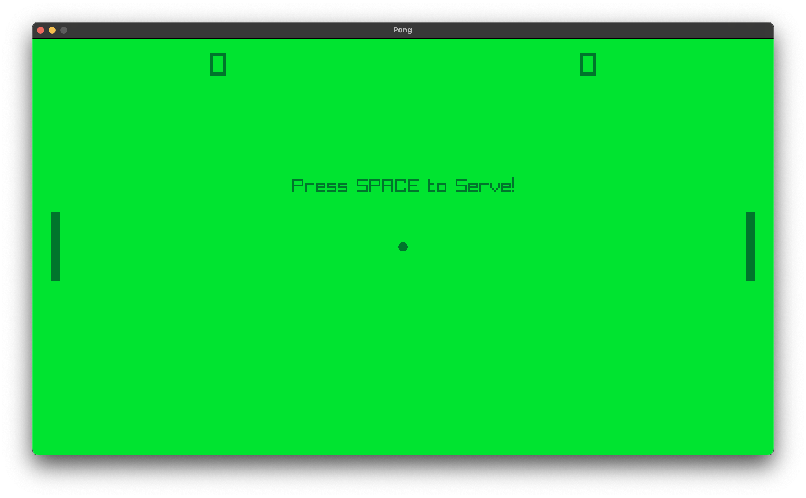
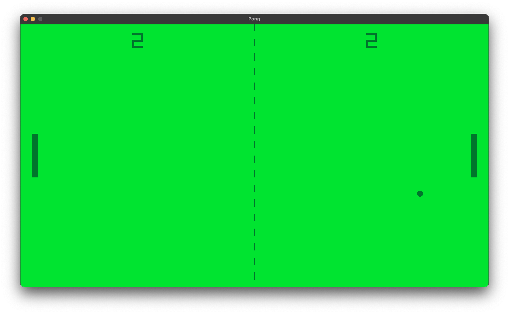
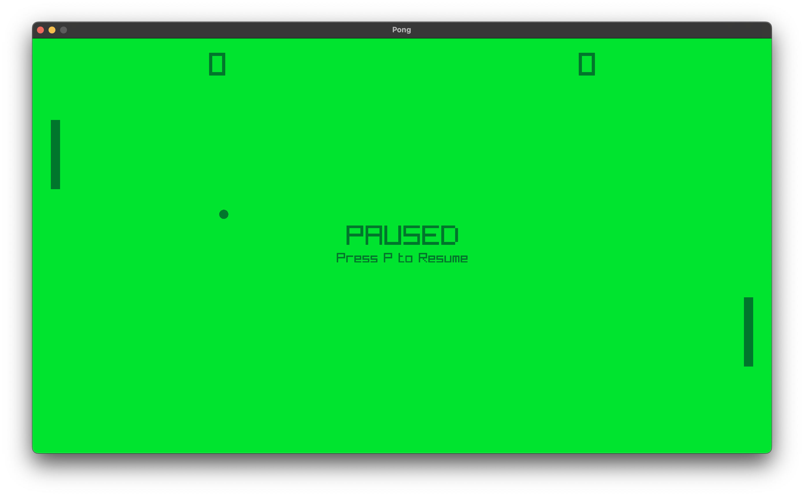
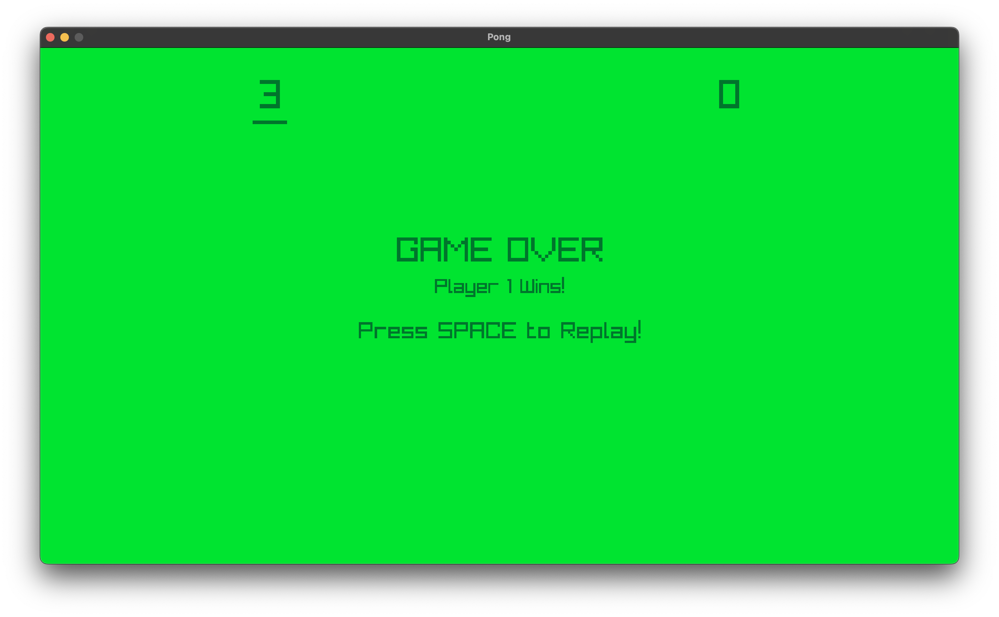

# Pong (C + Raylib)

A modern re-creation of the classic Pong game, built in **C** using the [Raylib](https://www.raylib.com/) library.  
This version includes clean visuals, a pause feature, serve mechanics, dynamic ball deflections, and a polished start/restart flow.

---

## 🎮 Features
- Two-player Pong (W/S for Player 1, ↑/↓ for Player 2).
- Serve mechanic: ball launches after pressing **SPACE**.
- Ball deflection angles based on where it hits the paddle.
- Increasing ball speed with each hit (up to a cap).
- Pause/unpause with **P**.
- Score tracking with win condition (first to 3 points).
- Replay after game over.
- Clean green-themed visuals (Dark Green paddles/ball/line, Green background).

---

## 🕹️ Controls
| Key          | Action                          |
|--------------|---------------------------------|
| **W / S**    | Move Player 1 paddle (up/down). |
| **↑ / ↓**    | Move Player 2 paddle (up/down). |
| **SPACE**    | Start game / Serve ball / Replay|
| **P**        | Pause / Resume game             |

---

## 📸 Screenshots

### Start Screen
The clean intro screen with title, instructions, and controls.


### Serve Screen
Ball waiting to be served. Players can move paddles before pressing **SPACE**.


### Play Screen
Active gameplay with ball movement, deflections, and scoring.


### Pause Screen
Game paused with scores frozen. Press **P** to resume.


### Game Over Screen
Game finished — winner shown with underline. Press **SPACE** to replay.


---

## 🎥 Demo Video
Click the preview image below to download and watch the demo:

[](assets/Play-Screen.mp4)

## ⚙️ Installation & Run

### Prerequisites
- **Raylib** installed (v5.5+ recommended).  
- **Make** and a C compiler (GCC/Clang).

### Build & Run (macOS/Linux)
```bash
make build_osx
./bin/build_osx